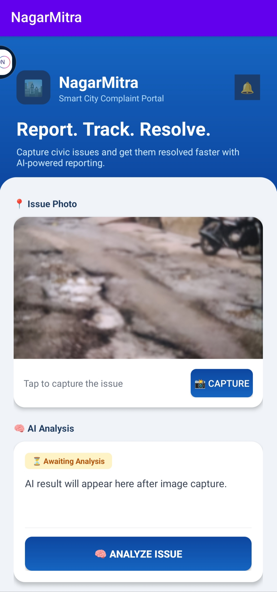
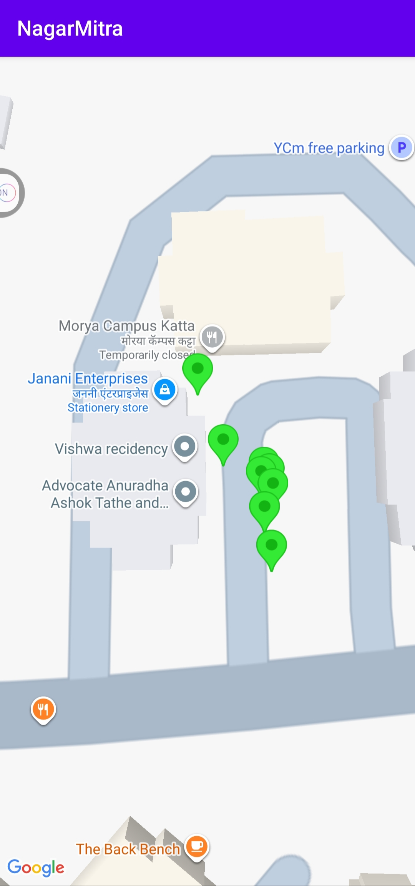
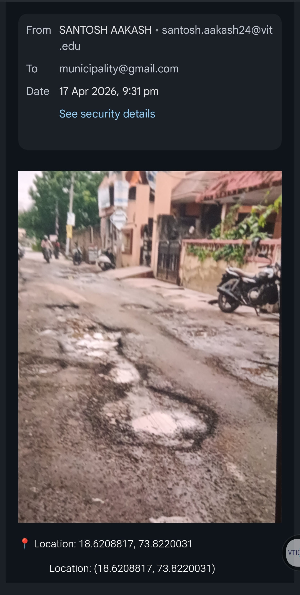
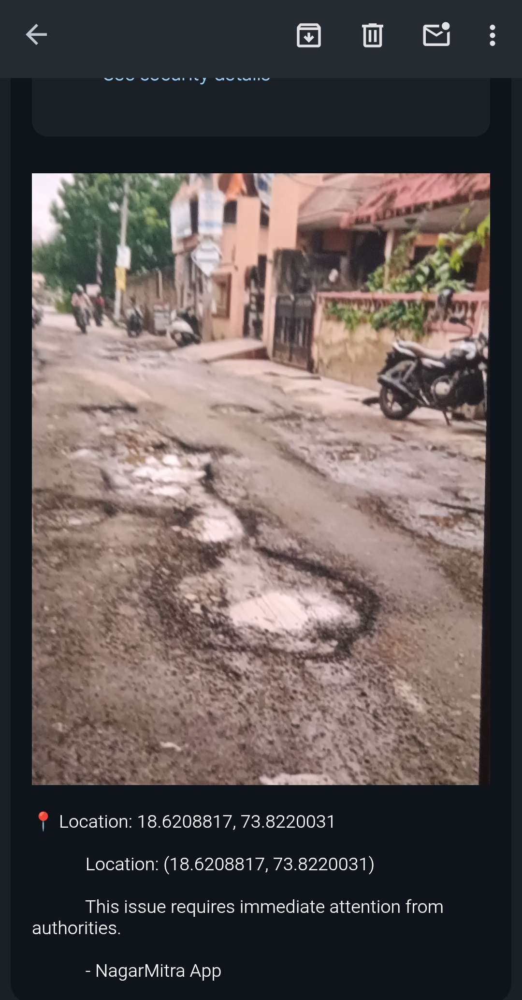

# NagarMitra 🚀

AI Powered Civic Issue Reporting App

## Problem
Citizens struggle to report potholes, garbage, broken roads, and civic issues.

## Solution
NagarMitra allows users to capture an issue photo, auto-tag GPS location, visualize complaints on map, and send reports to authorities.

## Features
- 📸 Camera Capture
- 📍 GPS Location Tagging
- 🗺 Google Maps Complaint Pins
- 📧 Email Complaint Reporting
- 📂 Complaint History
- 🤖 AI Ready Detection Module

## Tech Stack
- Android Studio
- Kotlin
- Google Maps API
- Camera API
- GPS Services

## Screenshots

### Home Screen

### Complaint Map

### Pothole Capture

### Complaint Email

## Future Scope
- AI Detection
- Firebase Backend
- Authority Dashboard
- Multi-language Support

## Team Leader
Aakash Dabhade
